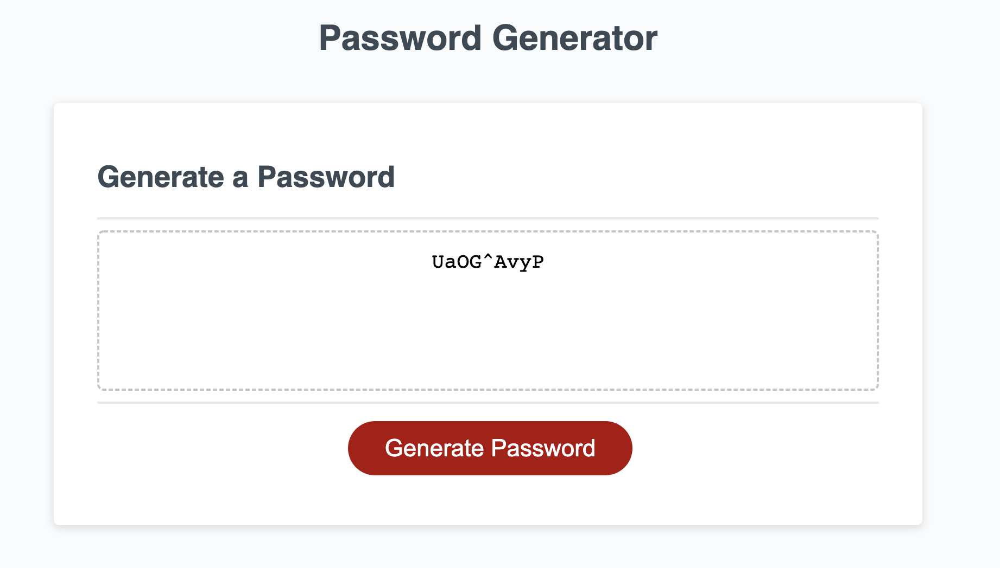

# Password Generator
The purpose of the application is to create a randomly generated password based on the user's criteria. The user will be prompted to enter a desired length of a password, as well as if they wish to include lowercase, uppercase, numeric, and/or special characters. Once the user gives the required information, a password will randomly be generated based on the user's input. 

The starter code was downloaded from an existing repository on GitHub.

## Built With:
- HTML
- CSS
- JavaScript

## Links
- [GitHub Repository](https://github.com/hlnicks/password-generator)
- [GitHub Page](https://hlnicks.github.io/password-generator/)

## Screenshots

&nbsp;

## Credits
- [Original Repo](https://github.com/coding-boot-camp/friendly-parakeet)

